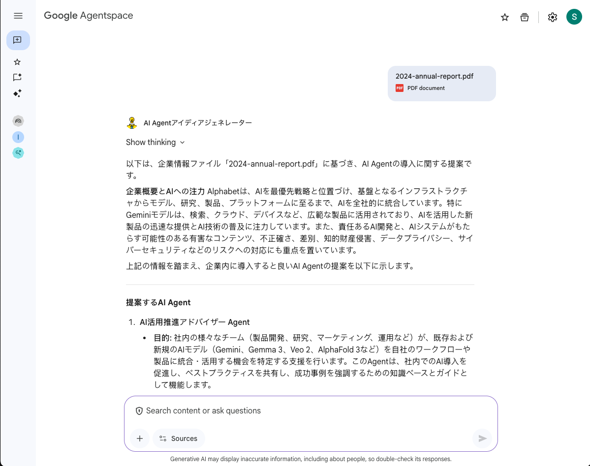

# ADKエージェント開発からAgentspace登録までの手順書

このドキュメントは、ADK (Agent Development Kit) を使用してマルチエージェントシステムを開発し、Vertex AI Agent Engineへデプロイ、さらにAgentspaceへ登録するまでの一連のプロセスをまとめたものです。

> [!WARNING]
> **免責事項**
>
> 本書に記載のコードおよび手順は、あくまで開発の参考として提供するものです。
> ご利用の際は、ご自身の環境で十分にテストを実施し、自己の責任においてご活用ください。

---



---

## フェーズ1: プロジェクトのセットアップとローカル開発

### 1. 仮想環境の作成と有効化

まず、プロジェクト専用のPython仮想環境を作成し、依存関係をクリーンに保ちます。高速な`uv`の使用を推奨します。

```bash
# uvで仮想環境を作成
uv venv

# 仮想環境を有効化 (macOS/Linuxの場合)
source .venv/bin/activate
```

### 2. 依存関係のインストールと`requirements.txt`の作成

ADKおよびAgent Engineへのデプロイに必要なライブラリを`uv`でインストール

```bash
# 必要なライブラリをインストール
uv pip install "google-cloud-aiplatform[adk,agent_engines]" cloudpickle python-dotenv

# インストールしたライブラリをrequirements.txtに書き出す
uv pip freeze > requirements.txt
```

### 3. プロジェクトのファイル構造

以下のファイル構造でプロジェクトを構築します。

```
.
├── ai_agent_idea_generator/
    ├── __init__.py         # モジュールとして認識させる
    ├── agent.py            # エージェント本体の定義
    └── .env                # 環境変数ファイル
```

- **`ai_agent_idea_generator/`**: エージェントのロジックを格納するメインディレクトリ。
- **`deploy.py`**: デプロイ処理のみを担当するスクリプト。
- **`requirements.txt`**: `pip freeze`によって生成された、プロジェクトの正確な依存関係を記録するファイル。

### 4. 環境変数の設定 (`.env`)

`ai_agent_idea_generator/.env` ファイルに、Google Cloudのプロジェクト情報を記述します。

```dotenv
# Google Cloud project details.
GOOGLE_CLOUD_PROJECT="<YOUR_PROJECT_ID>"
GOOGLE_CLOUD_LOCATION="us-central1"
STAGING_BUCKET="<BUCKET_NAME>"
GOOGLE_GENAI_USE_VERTEXAI="True"
```


### 5. ローカルでの動作確認

`adk web`コマンドを使用して、ローカル環境でエージェントの動作をテストします。

```bash
# 仮想環境を有効化した状態で実行
adk web
```

ブラウザで `http://localhost:8000` を開き、`ai_agent_idea_generator` を選択して対話を開始します。

---

## フェーズ2: Agent Engineへのデプロイ

### 0. 前提・事前準備
Google Cloud StorageのBucketが必要となりますので予め作成してください。
現時点でAgentspaceとAgent Engineは同一プロジェクトである必要があります。

### 1. デプロイスクリプト (`deploy.py`)

プロジェクトのルートに配置した`deploy.py`がデプロイ処理を担当します。このスクリプトは`.env`ファイルから設定を読み込み、`agent.py`で定義された`app`オブジェクトをAgent Engineにデプロイします。

### 2. Google Cloud認証とプロジェクト設定

デプロイを実行する前に、gcloud CLIの認証と対象プロジェクトの設定を行います。

```bash
# アプリケーションのデフォルト認証情報を設定（ブラウザでログイン）
gcloud auth application-default login

# gcloudの操作対象プロジェクトを設定
gcloud config set project <YOUR_PROJECT_ID>
```

### 3. デプロイの実行

以下のコマンドでデプロイスクリプトを実行します。

```bash
# 仮想環境を有効化した状態で実行
python deploy.py
```

成功すると、ターミナルに「🎉 デプロイが正常に完了しました！ 🎉」というメッセージと、デプロイされたエージェントのリソース名（`projects/.../reasoningEngines/...`）が表示されます。このリソース名は次のステップで必要になります。

---

## フェーズ3: Agentspaceへの登録

### 1. 前提条件: Discovery Engine APIの有効化

Agentspaceへの登録には、対象のGoogle Cloudプロジェクトで「Discovery Engine API」が有効になっている必要があります。以下のURLから有効化してください。

[https://console.developers.google.com/apis/api/discoveryengine.googleapis.com/overview?project=<YOUR_PROJECT_ID>](https://console.developers.google.com/apis/api/discoveryengine.googleapis.com/overview?project=<YOUR_PROJECT_ID>)

### 2. `curl`コマンドによる登録

以下の`curl`コマンドを使用して、デプロイしたAgent EngineインスタンスをAgentspaceに登録します。`<...>`の部分はご自身の環境に合わせて書き換えてください。

```bash
# 実行前に各IDを環境変数に設定してください
export PROJECT_ID="<YOUR_PROJECT_ID>"
export APP_ID="<YOUR_AGENTSPACE_APP_ID>"
export RESOURCE_ID="<YOUR_AGENT_ENGINE_RESOURCE_ID>"

curl -X POST \
  -H "Authorization: Bearer $(gcloud auth print-access-token)" \
  -H "Content-Type: application/json" \
  -H "X-Goog-User-Project: $PROJECT_ID" \
  "https://discoveryengine.googleapis.com/v1alpha/projects/$PROJECT_ID/locations/global/collections/default_collection/engines/$APP_ID/assistants/default_assistant/agents" \
  -d '{
    "displayName": "AI Agentアイディアジェネレーター",
    "description": "添付された企業情報のファイルからどのようなAI Agentを企業内で作成すると良いか提案するエージェント",
    "icon": {
       "uri": "https://www.svgrepo.com/show/302101/idea-brainstorm.svg"
     },
    "adk_agent_definition": {
      "tool_settings": {
        "tool_description": "添付された企業情報のファイルからどのようなAI Agentを企業内で作成すると良いか提案します"
      },
      "provisioned_reasoning_engine": {
        "reasoning_engine": "'"$RESOURCE_ID"'"
      }
    }
  }'
```

### 3. 登録の成功確認

コマンドが成功すると、エラーなくJSONオブジェクトが返却されます。`state: "ENABLED"`となっていれば登録は完了です。
